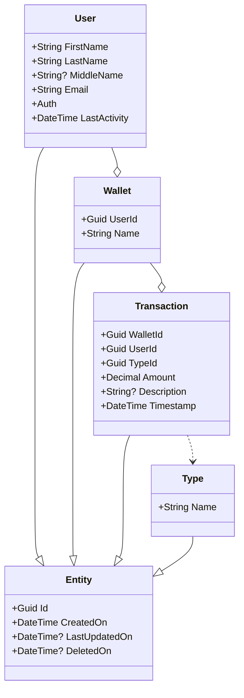

```mermaid
classDiagram

class Entity {
    +Guid Id
    +DateTime CreatedOn
    +DateTime? LastUpdatedOn
    +DateTime? DeletedOn
}

User --|> Entity

class User {
    +String FirstName
    +String LastName
    +String? MiddleName
    +String Email
    +Auth
    +DateTime LastActivity
}

User --o Wallet
Wallet --|> Entity

class Wallet {
    +Guid UserId
    +String Name
}

Wallet --o Transaction
Transaction --|> Entity

class Transaction {
    +Guid WalletId
    +Guid UserId
    +Guid TypeId
    +Decimal Amount
    +String? Description
    +DateTime Timestamp
}

Transaction ..> Type
Type --|> Entity

class Type {
    +String Name
}
```
