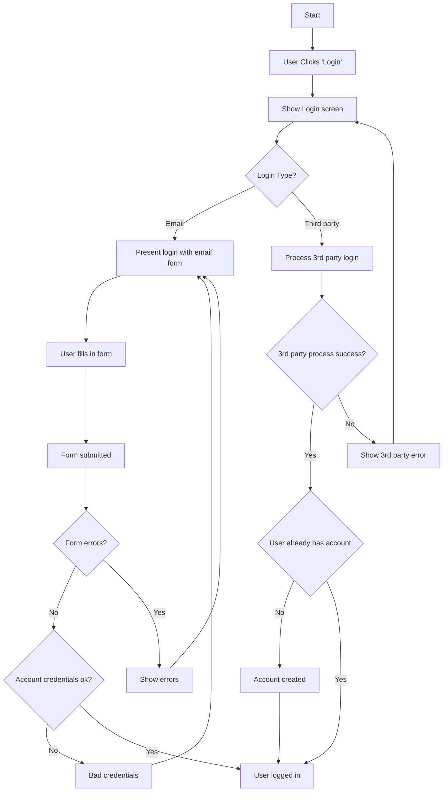

```mermaid
flowchart TD
    A[Start]
    B[User Clicks 'Login']
    C{Login Type?}
    D[Present login with email form]
    E[Account created]
    F[User logged in]
    G[Process 3rd party login]
    H{3rd party process success?}
    I{User already has account}
    J[User fills in form]
    K[Form submitted]
    L{Form errors?}
    M[Show errors]
    N{Account credentials ok?}
    O[Bad credentials]
    V[Show Login screen]
    U[Show 3rd party error]

    A --> B
    B --> V
    V --> C
    C -- Email --> D
    D --> J
    J --> K
    K --> L
    N -- No --> O
    N -- Yes --> F
    L -- No --> N
    L -- Yes --> M
    M --> D
    E --> F
    C -- Third party --> G
    G --> H
    H -- Yes --> I
    H -- No --> U
    U --> V
    I -- No --> E
    I -- Yes --> F
    O --> D
```
