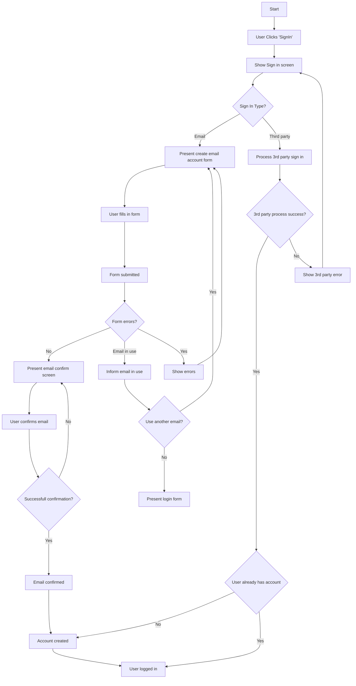

```mermaid
flowchart TD
    A[Start]
    B[User Clicks 'SignIn']
    V[Show Sign in screen]
    C{Sign In Type?}
    D[Present create email account form]
    E[Account created]
    F[User logged in]
    G[Process 3rd party sign in]
    H{3rd party process success?}
    I{User already has account}
    J[User fills in form]
    K[Form submitted]
    L{Form errors?}
    M[Show errors]
    N[Present email confirm screen]
    O[User confirms email]
    P{Successfull confirmation?}
    Q[Email confirmed]
    R[Inform email in use]
    S{Use another email?}
    T[Present login form]
    U[Show 3rd party error]

    A --> B
    B --> V
    V --> C
    C -- Email --> D
    D --> J
    J --> K
    K --> L
    L -- No --> N
    L -- Email in use -->R
    M --> D
    R --> S
    L -- Yes --> M
    N --> O
    O --> P
    P -- Yes --> Q
    P -- No --> N
    Q --> E
    E --> F
    C -- Third party --> G
    G --> H
    H -- Yes --> I
    H -- No --> U
    U --> V
    I -- No --> E
    I -- Yes --> F
    S -- No --> T
    S -- Yes --> D
```
